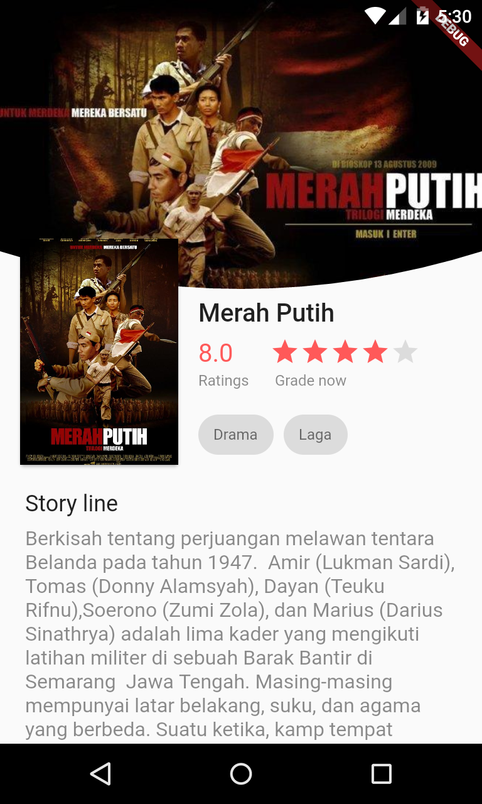
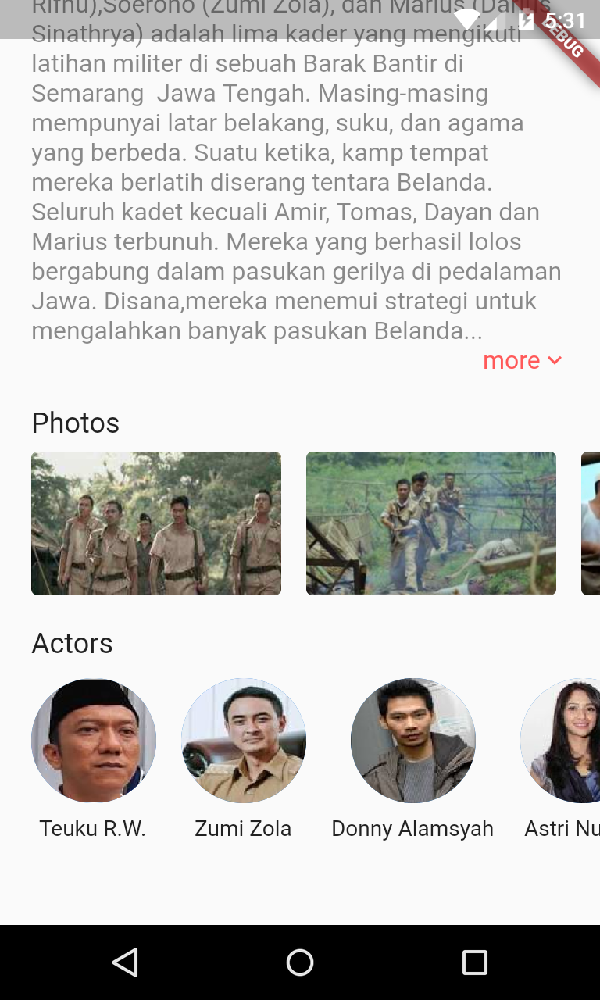

# Flutter Film Merah Putih ( Tugas 2 - OSG05 )
Aplikasi Flutter tentang Film Merah Putih yang bertemakan Hari Kemerdekaan Indonesia.

## Screenshot

## Built With
- [Flutter](https://flutter.dev)
- [Material Component Widgets](https://flutter.dev/docs/development/ui/widgets/material)
- [SingleChildScrollView](https://api.flutter.dev/flutter/widgets/SingleChildScrollView-class.html)
- [Stack](https://api.flutter.dev/flutter/widgets/Stack-class.html)
- [Chip](https://api.flutter.dev/flutter/material/Chip-class.html)
- [ClipPath](https://api.flutter.dev/flutter/widgets/ClipPath-class.html)
- [CustomClipper](https://api.flutter.dev/flutter/rendering/CustomClipper-class.html)
- [quadraticBezierTo](https://api.flutter.dev/flutter/dart-ui/Path/quadraticBezierTo.html)
- [ListView](https://api.flutter.dev/flutter/widgets/ListView-class.html)

## Created By
- [Muhammad Fari Madyan](https://github.com/MuhammadFariMadyan)

---

### Online Study Group Eudeka!
Salah satu program dari [**Eudeka!**](https://www.eudeka.id) untuk belajar secara _full online_ via Whatsapp/Telegram dan Google Classroom, dengan para praktisi handal di bidangnya. Selain itu juga kamu dapat berkesempatan untuk memperluas koneksimu dengan peserta lain.

### OSG05 - Flutter Basic
Dengan jangka waktu lebih kurang 2 bulan, peserta diharapkan dapat mengenal dan membuat aplikasi simple Flutter dengan menggunakan data dari internet (API).

### Cara Mendaftar Online Study Group
Untuk pendaftaran kelas selanjutnya, silahkan kunjungi atau hubungi kami di dawah ini.

### Info Lebih Lengkap
Website : [www.eudeka.id](https://www.eudeka.id)  
Twitter: [@EudekaID](https://twitter.com/EudekaID)  
Telegram : [@eudekainfo](https://t.me/eudekainfo)  
Instagram : [@eudeka.id](https://instagram.com/eudeka.id)  
WhatsApp : [0895351577557](https://wa.me/62895351577557)  
Email : [info@eudeka.id](mailto:info@eudeka.id)  

---

###### tags: `Flutter` `Eudeka` `OSG05`